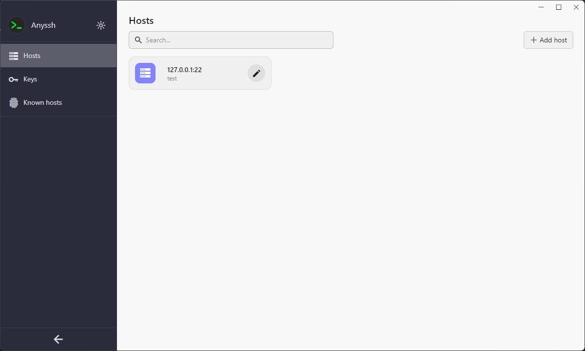
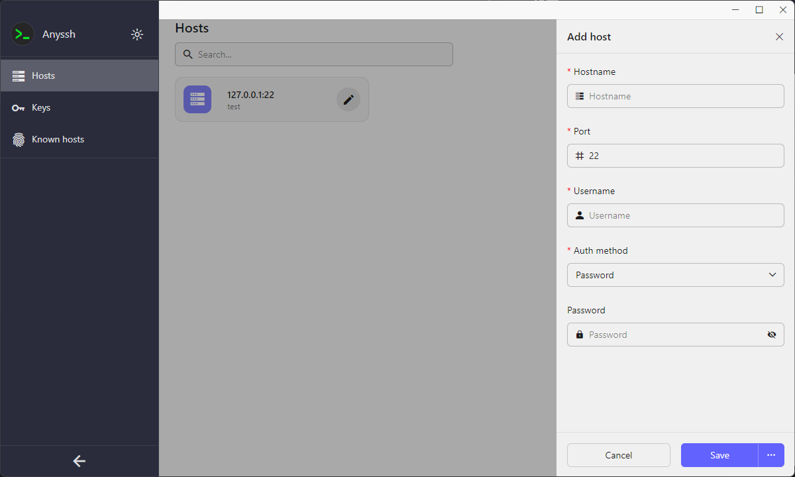
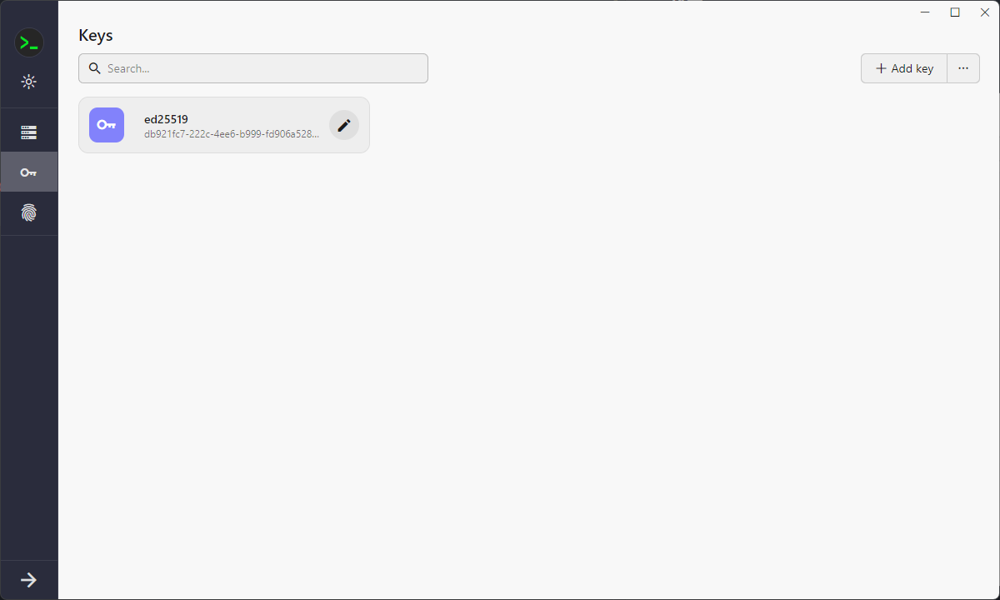
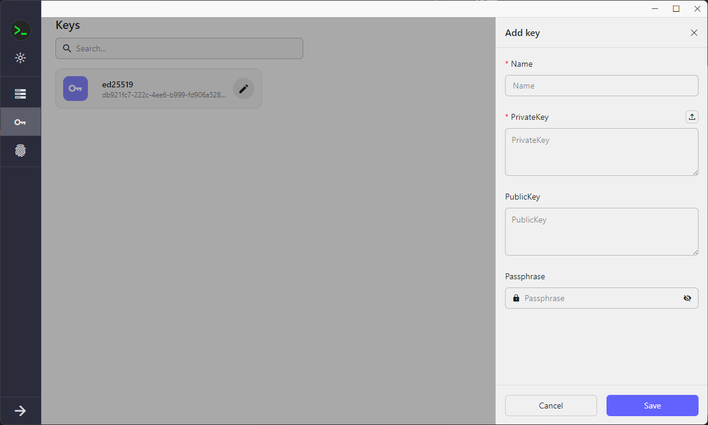
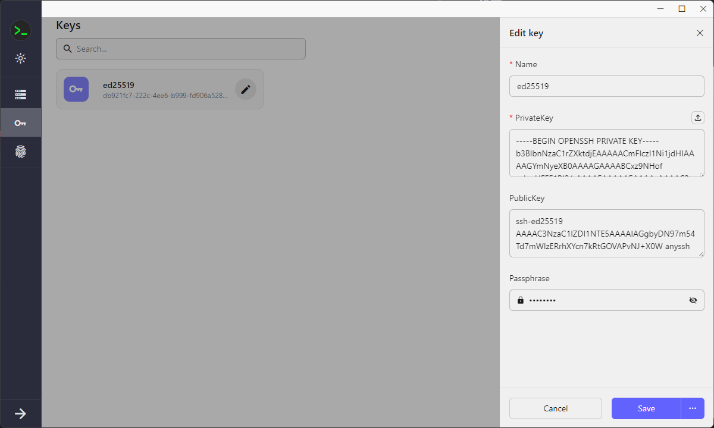
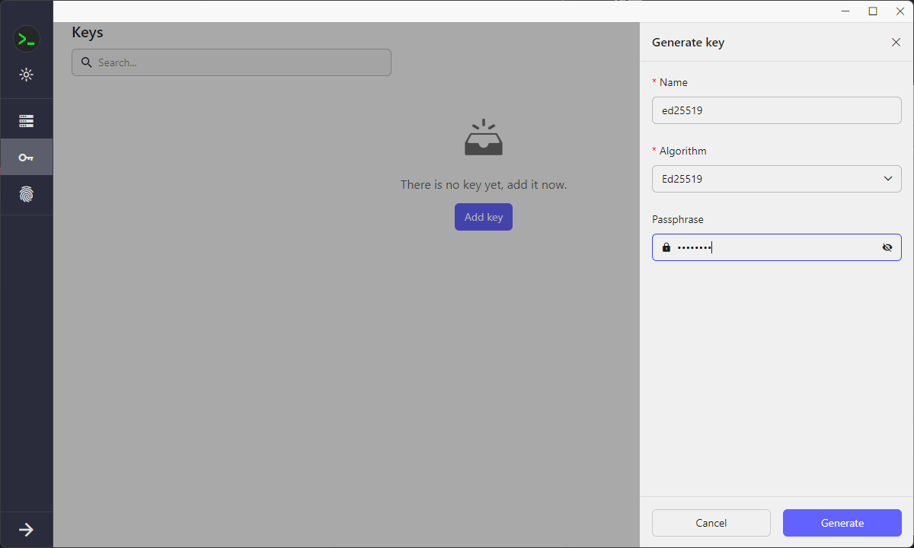
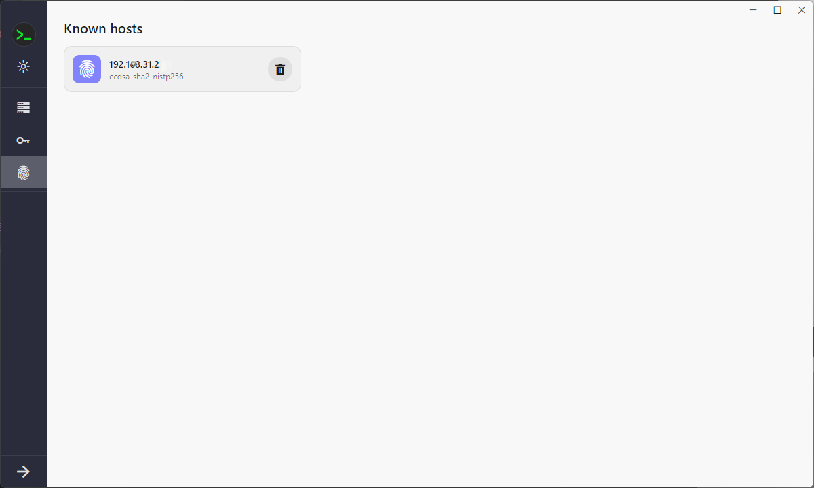
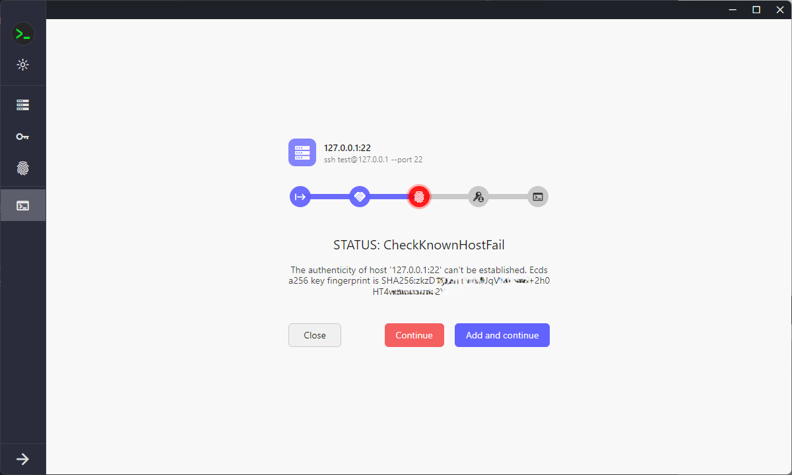
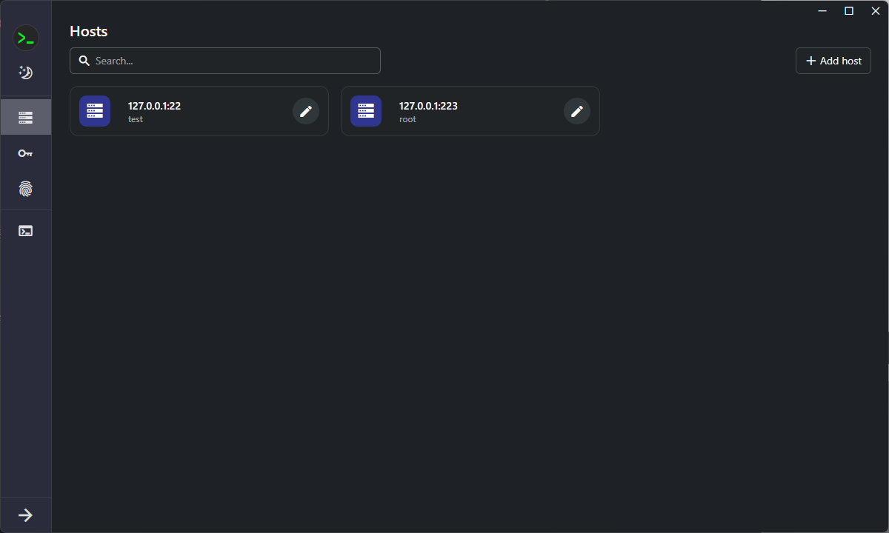

# Anyssh Release

This repository is mainly used to release versions of anysh， You can download the latest version [here](https://github.com/anyssh/release/releases). Anyssh is a cross-platform SSH client.

## Features

- Cross platform: support Windows, MacOS, Linux, Android and iOS (coming soon)
- Theme switching: supports light and dark themes.

## Screenshots

### Hosts

- Main page
  

- Add host
  

- Edit host
  

### Keys

- Main page
  

- Add key
  

- Edit key
  

- Generate key
  

### Known hosts

- Main page
  

### SSH

- SSH connecting
  

- SSH terminal
  

### Theme

- Dark theme
  
