# Shell360 Release

Shell360 is a cross-platform SSH client.

This repository is mainly used to release versions of Shell360， You can download the latest version [here](https://github.com/shell360/release/releases). 

## Features

- Cross platform: support Windows, MacOS, Linux, Android and iOS.
- SSH key: support ED25519、RSA、ECDSA SSH Key
- Theme switching: supports light and dark themes.
- Import/Export App config.

## Privacy Policy

[Privacy Policy](./Privacy-Policy.md)
[隐私政策](./Privacy-Policy-zh_CN.md)

## Desktop Screenshots

### Hosts

- Main page
  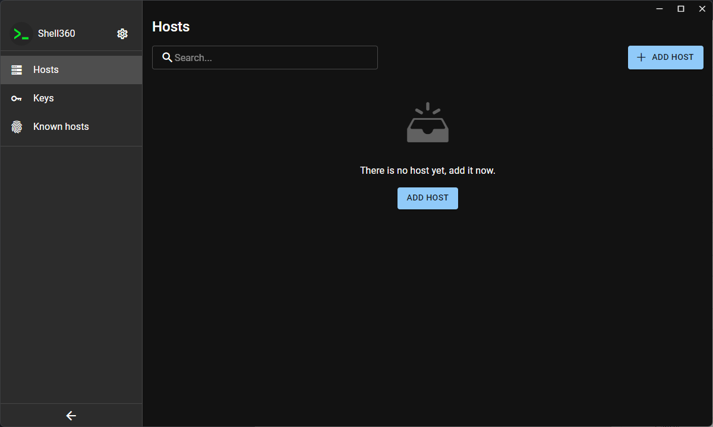

- Add host
  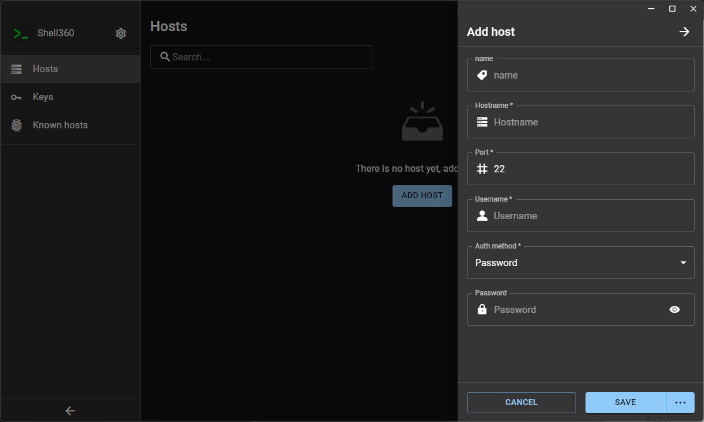

### Keys

- Main page
  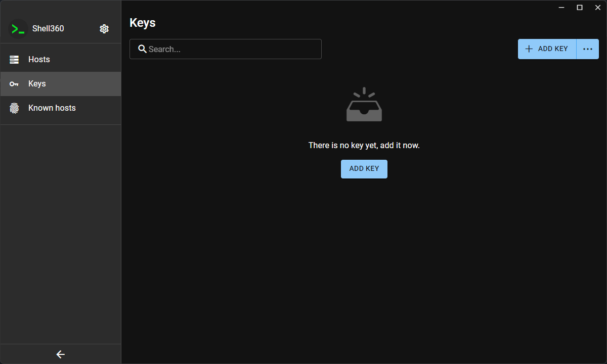

- Add key
  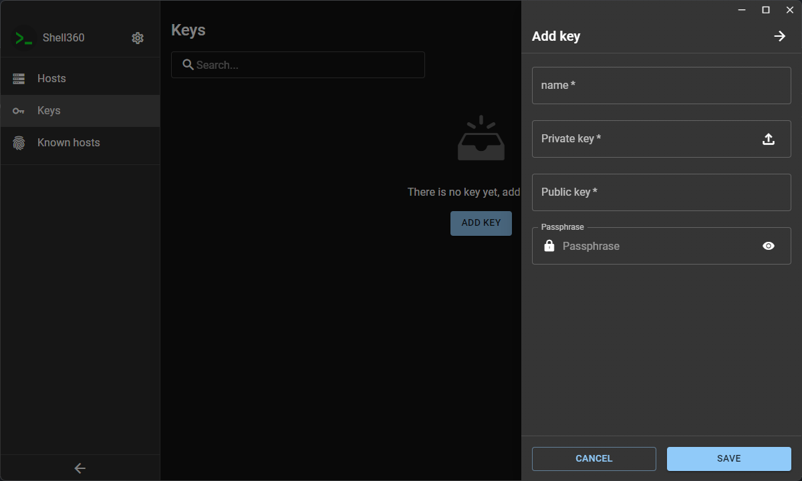

- Generate key
  

### Known hosts

- Main page
  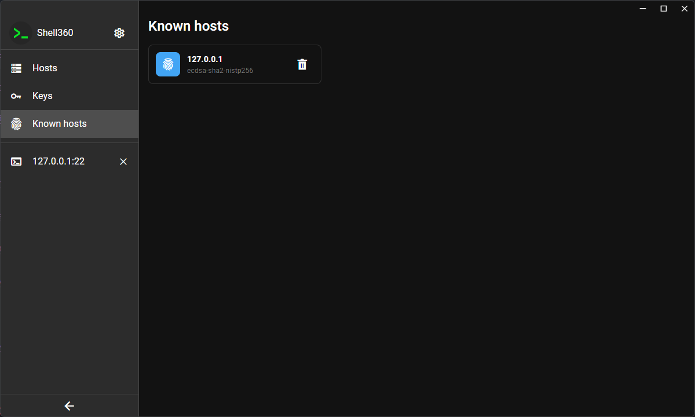

### SSH

- SSH connecting
  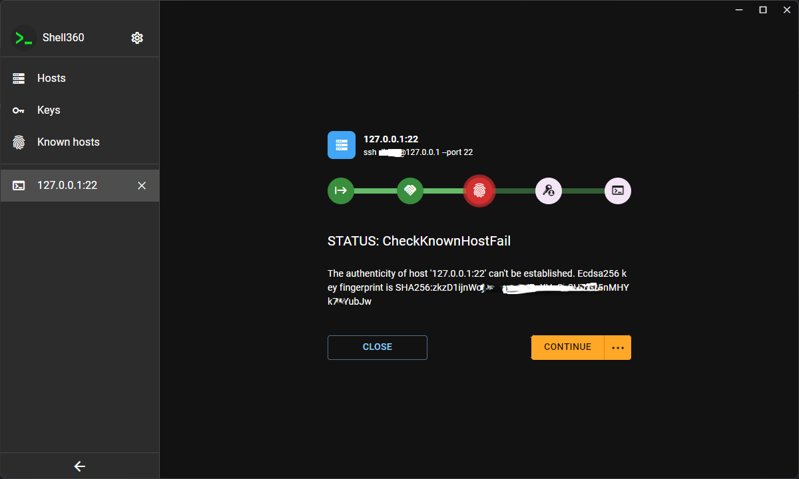

- SSH terminal
  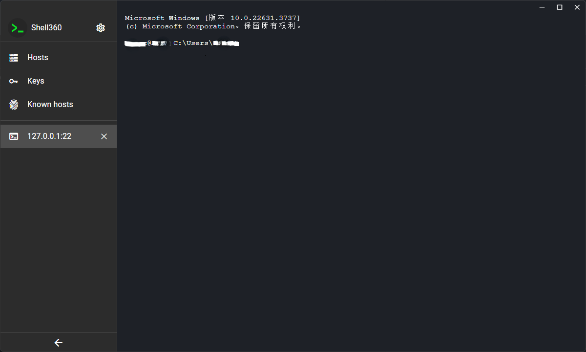

### Settings

- Settings
  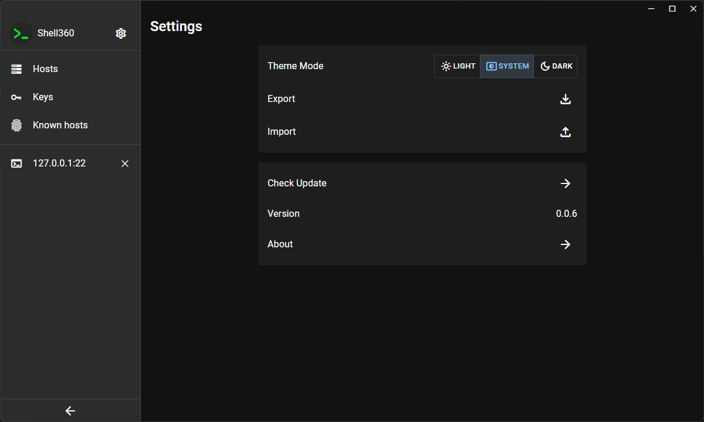

## Mobile Screenshots

### Hosts

| Mainpage                                 | Add host                                     |
| ---------------------------------------- | -------------------------------------------- |
|  | 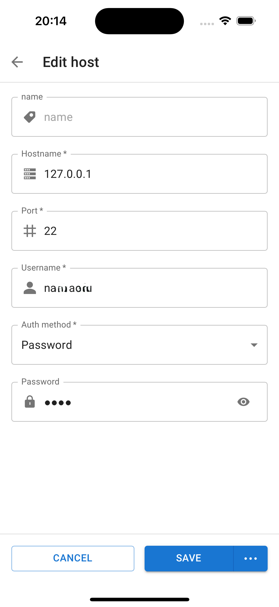 |

### Keys

| Mainpage                               | Add key                                    | Generate key                                         |
| -------------------------------------- | ------------------------------------------ | ---------------------------------------------------- |
| 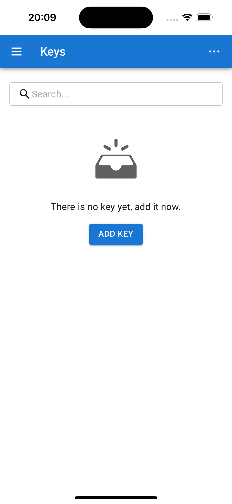 | 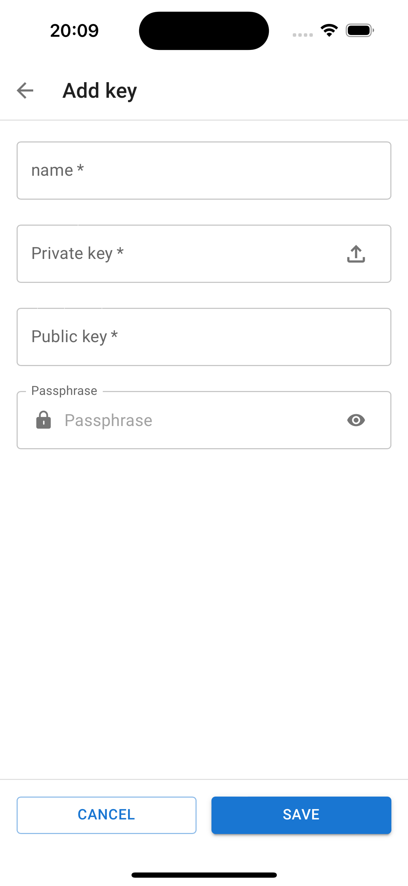 | 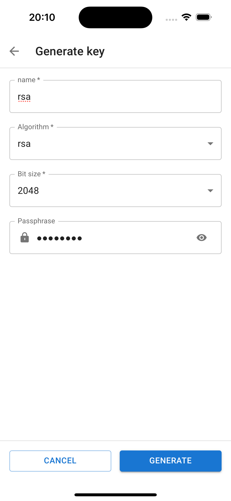 |

### Known hosts & SSH

| Known hosts                                        | SSH connecting                       | SSH terminal                                   |
| -------------------------------------------------- | ------------------------------------ | ---------------------------------------------- |
|  | 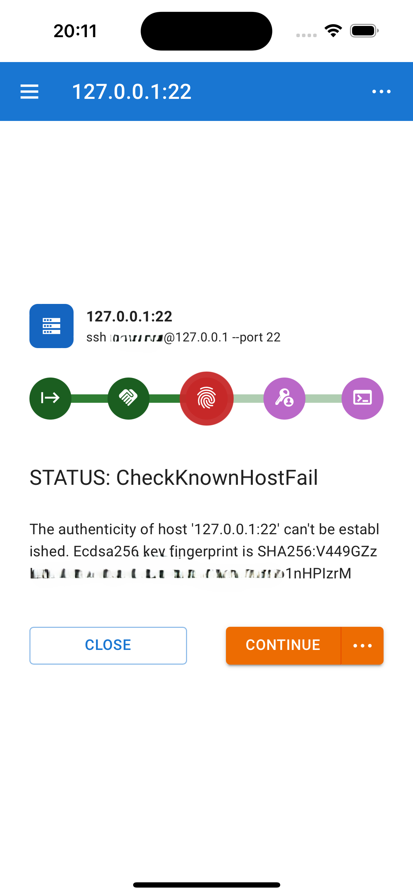 | 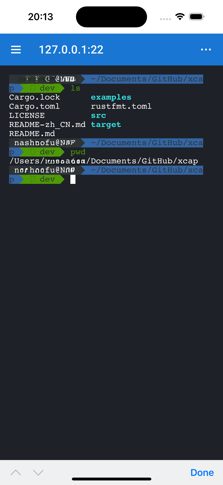 |

### Settings & IAP

| Settings                                       | IAP                                  |
| ---------------------------------------------- | ------------------------------------ |
| 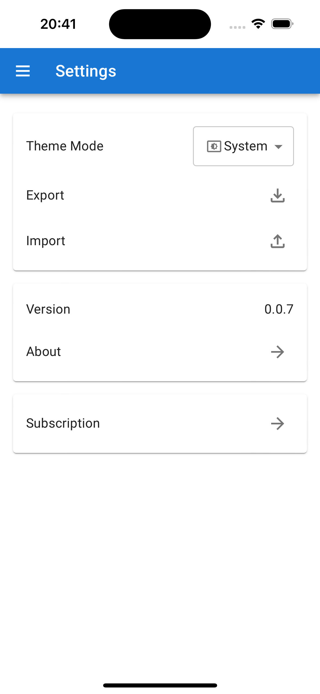 | 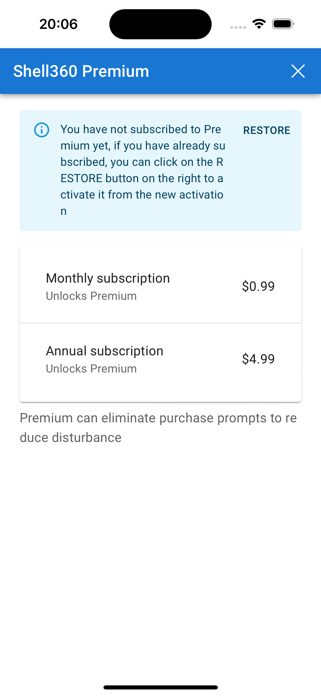 |
