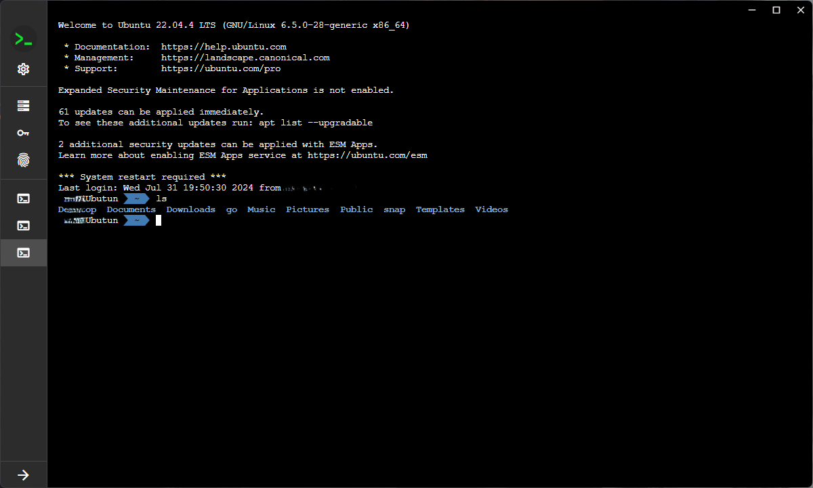
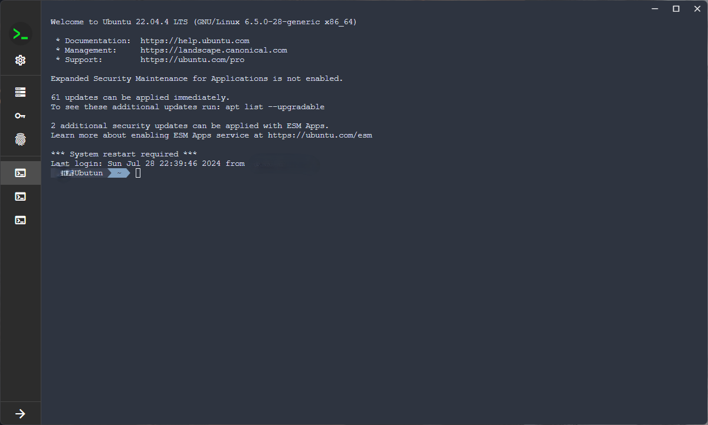
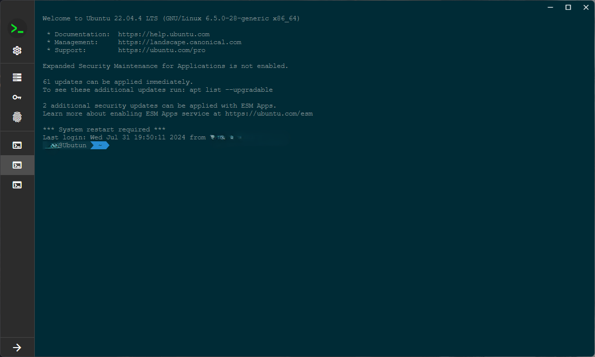
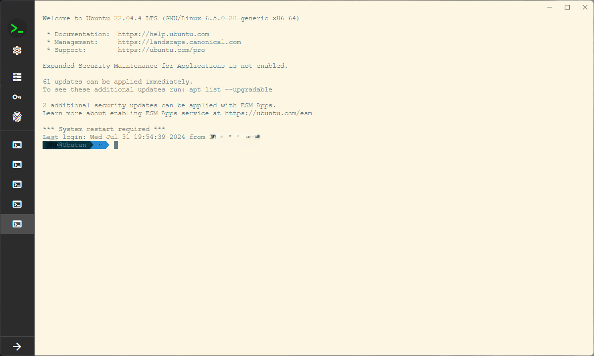

# Shell360 Release

Shell360 is a cross-platform SSH client.

This repository primarily serves to release updated versions of Shell360. You can download [the latest version](https://github.com/shell360/release/releases) from here. Furthermore, we warmly welcome your participation in our [TestFlight](https://testflight.apple.com/join/teqJZCRm) testing program.

## Features

- Cross platform: support Windows, MacOS, Linux, Android and iOS.
- SSH key: support ED25519、RSA、ECDSA SSH Key
- Theme switching: supports light and dark themes.
- Import/Export App config.
- Customize terminal: Supports 6 themes and customizable fonts

## Privacy Policy

[Privacy Policy](./Privacy-Policy.md)
[隐私政策](./Privacy-Policy-zh_CN.md)

## Desktop Screenshots

### Hosts

- Main page
  

- Add host
  

### Keys

- Main page
  

- Add key
  

- Generate key
  

### Known hosts

- Main page
  

### SSH

- SSH connecting
  

- SSH terminal
  

### Terminal themes

<table>
  <tbody>
    <tr>
      <td>
        
      </td>
      <td>
        
      </td>
    </tr>
    <tr>
        <td>
          
        </td>
        <td>
          
        </td>
      </tr>
  </tbody>
</table>

### Settings

- Settings
  

## Mobile Screenshots

### Hosts

<table>
  <thead>
    <tr>
      <th>Mainpage</th>
      <th>Add host</th>
    </tr>
  </thead>
  <tbody>
    <tr>
      <td>
        
      </td>
      <td>
        
      </td>
    </tr>
  </tbody>
</table>

### Keys

<table>
  <thead>
    <tr>
      <th>Mainpage</th>
      <th>Add key</th>
      <th>Generate key</th>
    </tr>
  </thead>
  <tbody>
    <tr>
      <td>
        
      </td>
      <td>
        
      </td>
      <td>
        
      </td>
    </tr>
  </tbody>
</table>

### Known hosts & SSH

<table>
  <thead>
    <tr>
      <th>Known hosts</th>
      <th>SSH connecting</th>
      <th>SSH terminal</th>
    </tr>
  </thead>
  <tbody>
    <tr>
      <td>
        
      </td>
      <td>
        
      </td>
      <td>
        
      </td>
    </tr>
  </tbody>
</table>

### Settings & IAP

<table>
  <thead>
    <tr>
      <th>Settings</th>
      <th>IAP</th>
    </tr>
  </thead>
  <tbody>
    <tr>
      <td>
        
      </td>
      <td>
        
      </td>
    </tr>
  </tbody>
</table>
